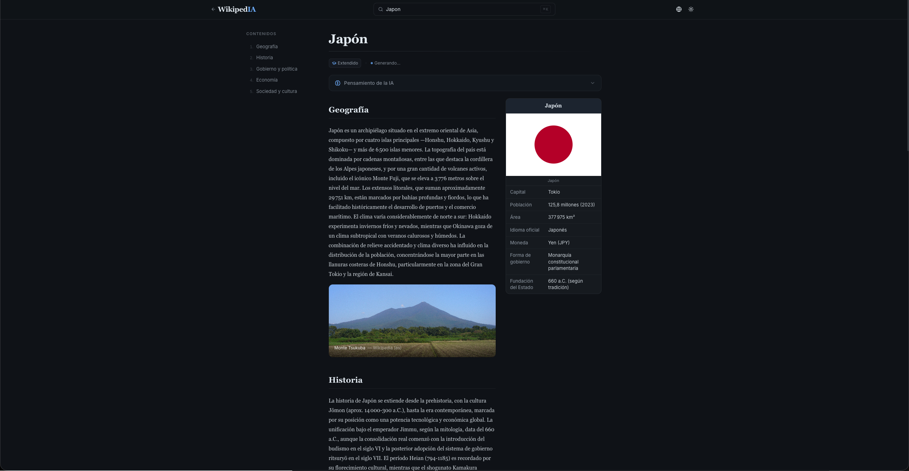

# Wikiped**IA**

Enciclopedia con inteligencia artificial. Busca cualquier tema y obtén un artículo completo generado por IA con infobox, imágenes y artículos relacionados.

**Disponible en [wikipedia.noahlezama.com](https://wikipedia.noahlezama.com/)**

<p align="center">
  
</p>

## Screenshots

| Landing                                                     | Artículo                                                     |
| ----------------------------------------------------------- | ------------------------------------------------------------ |
|  |  |

## Stack

- **React 19** + **TypeScript** + **Vite**
- **Tailwind CSS v4** + **shadcn/ui**
- **OpenRouter API** — streaming SSE con modelos gratuitos
- **Wikipedia API** — imágenes por sección

## Características

- 3 modos de artículo: rápido, medio y extendido
- Selector de modelo de IA (Nemotron, GLM, ChatGPT)
- Infobox estructurado generado por IA
- Imágenes automáticas por sección vía Wikipedia
- Historial de búsquedas y caché de artículos en localStorage
- Artículos relacionados sugeridos por IA
- Interfaz en español e inglés
- Modo claro y oscuro
- Desplegable como Docker

## Requisitos

- Node.js 20+
- pnpm
- API key de [OpenRouter](https://openrouter.ai)

## Instalación

```bash
pnpm install
```

Crea un archivo `.env` en la raíz:

```
VITE_OPENROUTER_API_KEY=tu_api_key
```

## Desarrollo

```bash
pnpm dev
```

## Build

```bash
pnpm build
pnpm preview
```

## Docker

```bash
docker build -t wikipedia .
docker run -p 80:80 wikipedia
```
